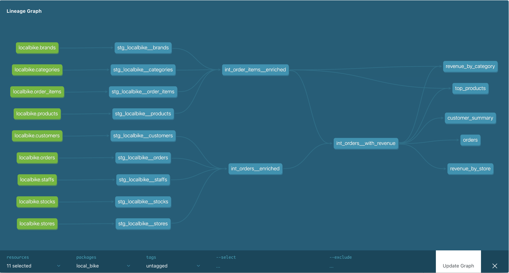

# Local Bike — Analytics Engineering Project

[](https://github.com/jeremy6680/databird-local-bike/actions/workflows/ci.yml)
[](https://github.com/jeremy6680/databird-local-bike/actions/workflows/cd.yml)
[](https://local-bike-docs.jeremymarchandeau.com/)
[](https://local-bike-data.jeremymarchandeau.com/public/dashboard/9dc87740-46b7-47d1-88a7-13578c238598)

> **DataBird Analytics Engineering Bootcamp — Capstone Project · Apr–Jun 2026**  
> **Author:** [Jeremy Marchandeau](https://jeremymarchandeau.com)

---

## Overview

**Local Bike** is an American cycling retailer founded in 2016 by Alexander Anthony — former
professional cyclist (Tour de France). The company operates three stores across the United States
(Santa Cruz CA, Baldwin NY, Rowlett TX) with a mission to democratise urban cycling.

This project is Local Bike's **first data system**: a fully tested and documented dbt pipeline
that transforms raw transactional data into BI-ready mart tables, connected to a Metabase dashboard
enabling the operations team to optimise sales and maximise revenue. A narrative analysis of the
key findings is available in [`docs/INSIGHTS.md`](docs/INSIGHTS.md).

---

## Live links

|                           |                                                                                                     |
| ------------------------- | --------------------------------------------------------------------------------------------------- |
| 📊 **Metabase dashboard** | https://local-bike-data.jeremymarchandeau.com/public/dashboard/9dc87740-46b7-47d1-88a7-13578c238598 |
| 📖 **dbt docs**           | https://local-bike-docs.jeremymarchandeau.com/                                                      |
| 🐙 **GitHub repository**  | https://github.com/jeremy6680/databird-local-bike                                                   |

---

## Stack

| Tool                                                                                   | Version | Role                                   |
| -------------------------------------------------------------------------------------- | ------- | -------------------------------------- |
| [dbt Core](https://docs.getdbt.com/)                                                   | 1.11.10 | Transformation, testing, documentation |
| [dbt-bigquery](https://docs.getdbt.com/docs/core/connect-data-platform/bigquery-setup) | 1.11.1  | BigQuery adapter                       |
| [BigQuery](https://cloud.google.com/bigquery)                                          | —       | Cloud data warehouse (EU region)       |
| [Metabase](https://www.metabase.com/)                                                  | —       | BI dashboards (hosted on Hetzner VPS)  |
| [GitHub Actions](https://docs.github.com/en/actions)                                   | —       | CI/CD pipeline                         |
| [Netlify](https://www.netlify.com/)                                                    | —       | dbt docs hosting                       |

---

## AI assistance

This project was developed with Claude (Anthropic) as an AI assistant — primarily for drafting `.yml` descriptions, setting up generic tests, structuring SQL models, and unblocking technical issues specific to BigQuery.
Architecture decisions, business logic, and refactoring choices are my own.

---

## Architecture

Three-layer medallion architecture — sources → staging → intermediate → mart.



| Layer        | Prefix                   | Materialisation | Role                                          |
| ------------ | ------------------------ | --------------- | --------------------------------------------- |
| Staging      | `stg_<source>__<entity>` | View            | Cast, rename, defensive cleaning              |
| Intermediate | `int_<entity>__<verb>`   | View            | Joins, business logic, derived columns        |
| Mart         | `<entity>`               | Table           | Aggregations, BI-ready, connected to Metabase |

### Mart models

| Model                 | Description                                                        |
| --------------------- | ------------------------------------------------------------------ |
| `orders`              | Incremental — full enriched order history (`unique_key: order_id`) |
| `revenue_by_store`    | Monthly revenue aggregated by store                                |
| `revenue_by_category` | Monthly revenue aggregated by product category                     |
| `top_products`        | Product ranking by revenue and units sold                          |
| `customer_summary`    | Per-customer LTV, order count, average basket                      |

---

## Data quality

Every model is covered by generic tests (`not_null`, `unique`, `relationships`, `accepted_values`)
and singular tests for domain-specific constraints:

- Positive quantities and prices on all order lines
- Non-negative stock quantities
- Date consistency (`order_date ≤ required_date`, `shipped_date ≥ order_date`)
- Join grain validation — no row explosion at the intermediate layer
- Non-negative revenue on all mart financial metrics

---

## Local setup

### Prerequisites

- Python 3.11+
- A GCP Service Account with `BigQuery Data Editor` + `BigQuery Job User` roles
- A BigQuery project with the source dataset loaded (or access to an existing one)

### Install

```bash
git clone https://github.com/jeremy6680/databird-local-bike.git
cd databird-local-bike
pip install -r requirements.txt
dbt deps
```

### Configure

Create `~/.dbt/profiles.yml` (never commit this file):

```yaml
local_bike:
  target: dev
  outputs:
    dev:
      type: bigquery
      method: service-account-json
      project: "{{ env_var('DBT_PROJECT_ID') }}"
      dataset: "{{ env_var('DBT_DATASET') }}"
      keyfile_json: "{{ env_var('GOOGLE_APPLICATION_CREDENTIALS') }}"
      location: EU
      threads: 4
      timeout_seconds: 300
```

### Run

```bash
# Verify connection
dbt debug

# Run all models (dev)
dbt run

# Run tests
dbt test

# First run of the incremental model
dbt run --full-refresh --select orders

# Generate and serve docs locally
dbt docs generate && dbt docs serve
```

---

## CI/CD

| Workflow                   | Trigger               | Steps                                                                                     |
| -------------------------- | --------------------- | ----------------------------------------------------------------------------------------- |
| **CI — Slim build**        | `pull_request → main` | `dbt run --select state:modified+` → `dbt test` → `dbt docs generate`                     |
| **CD — Production deploy** | `push → main`         | `dbt run` → `dbt test` → `dbt docs generate` → upload `manifest.json` → deploy to Netlify |

The CI uses a **slim strategy**: only modified models and their downstream dependencies are rebuilt,
using `--defer` to resolve unmodified upstream `ref()` calls against production tables.

### Required GitHub Secrets

| Secret                    | Description                                                                                            |
| ------------------------- | ------------------------------------------------------------------------------------------------------ |
| `GCP_SERVICE_ACCOUNT_KEY` | Full Service Account JSON (roles: `BigQuery Data Editor`, `BigQuery Data Viewer`, `BigQuery Job User`) |
| `DBT_PROJECT_ID`          | Your BigQuery project ID                                                                               |
| `DBT_DATASET`             | Target dataset for production models                                                                   |
| `NETLIFY_AUTH_TOKEN`      | Netlify personal access token                                                                          |
| `NETLIFY_SITE_ID`         | Netlify site ID                                                                                        |

---

## Project documentation

| File                                               | Description                                       |
| -------------------------------------------------- | ------------------------------------------------- |
| [`docs/SPECIFICATIONS.md`](docs/SPECIFICATIONS.md) | Project scope, architecture, KPIs                 |
| [`docs/DECISIONS.md`](docs/DECISIONS.md)           | Architecture decision records (ADR-001 → ADR-022) |
| [`docs/NEXT_STEPS.md`](docs/NEXT_STEPS.md)         | Task backlog and priorities                       |
| [`docs/STRUCTURE.md`](docs/STRUCTURE.md)           | Full project folder structure                     |
| [`docs/INSIGHTS.md`](docs/INSIGHTS.md)             | Revenue analysis — insights and recommendations   |


---

## License

This project was built as a capstone for the [DataBird](https://www.databird.co/) Analytics
Engineering bootcamp. Source data is provided by DataBird and is not redistributed.
